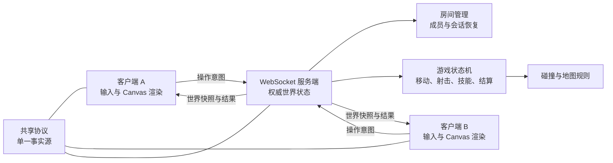

# AI 坦克竞技场交付文档

> 任务书：<https://docs.corp.kuaishou.com/d/home/fcAAVD-4ur8JdyNipTLRijIdz>
> 文档状态：待团队补充信息的正式交付稿
> 生成日期：2026-07-30
> 说明：标记为 `【待项目成员填写】` 或 `【待人工验证】` 的内容，需要团队在正式提交前补齐。

## 1. 项目基本信息

| 项目 | 内容 |
|---|---|
| 作品名称 | AI 坦克竞技场 |
| 作品形态 | 浏览器在线多人坦克对战游戏 |
| 参赛团队 | 【待项目成员填写：团队名称】 |
| 团队成员 | 【待项目成员填写：姓名、工号或花名】 |
| 团队分工 | 【待项目成员填写：客户端、服务端、AIGC、工程与质量负责人】 |
| 代码仓库 | 【待项目成员填写：仓库 URL】 |
| 提交分支 | `main` |
| 交付 Commit | 【待项目成员填写：最终推送后的 commit SHA】 |
| 预览地址 | 【待项目成员填写：公司工程平台预览或发布地址】 |
| 演示视频 | 【待项目成员填写：视频或云文档链接】 |
| 开发总耗时 | 【待项目成员填写：实际耗时与各阶段时间】 |

## 2. 交付摘要

本项目实现了一个基于浏览器的 2～4 人在线坦克对战游戏。客户端使用 React、TypeScript、Vite 和 Canvas 2D，服务端使用 Node.js、TypeScript 与 WebSocket。客户端只发送移动、射击、冲刺等操作意图，房间、玩家、坦克、子弹、生命值、碰撞、淘汰、复活和胜负结果由服务端统一维护和裁决，再以世界快照同步给同房间客户端。

交付范围不仅覆盖任务书要求的最小多人对战闭环，还包含：

- 无尽死斗与经典模式两种对局规则；
- 草原丛林、荒漠戈壁、雪原冻土、城市废墟及随机地图主题；
- 冲刺、技能球、护盾、治疗、连射、散射、穿透、反弹等扩展玩法；
- 意外断线自动恢复，以及主动退出后在本局结束前手动返回；
- AIGC 像素美术资产、资源加载失败降级渲染；
- 单元、集成、压力、专项协议与浏览器鲁棒性测试；
- 3 个具备完整七要素的可复用 Skill，其中 1 个专门面向美术资产生产。

## 3. 交付物清单

| 类别 | 交付物 | 位置或链接 | 状态 |
|---|---|---|---|
| 源代码 | 客户端、服务端、共享协议 | `client/`、`server/`、`shared/` | 已完成 |
| 启动脚本 | 一键安装依赖并启动两端 | `start.sh` | 已完成 |
| 使用说明 | 环境、启动、联机、操作和开发命令 | `README.md` | 已完成并同步当前双模式、技能与重连行为 |
| 测试说明 | 测试目录、命令和覆盖点 | `TESTING.md` | 已完成并同步当前断线与主动退出行为 |
| 美术资产 | 坦克、地图、障碍、子弹、爆炸、击杀标记 | `tank-battle-assets-1.0/`、`client/public/assets/` | 已完成 |
| 美术 Skill | 像素俯视角游戏资产生产 | `.codeflicker/skills/pixel-topdown-game-assets/` | 已完成 |
| 研发 Skill | 需求澄清、实现和可执行回归闭环 | `.codeflicker/skills/spec-driven-delivery/` | 已完成 |
| Git Skill | 提交筛噪、粒度判断和安全同步 | `.codeflicker/skills/git-delivery-hygiene/` | 已完成（额外交付） |
| 测试代码 | 单元、集成、压力、E2E 与专项回归 | `server/test/`、`client/test/`、`e2e/`、`server/scripts/` | 已完成；Vitest 与专项协议回归通过，浏览器 E2E 待补运行时后复验 |
| 平台预览 | 公司工程平台发布或预览 | 【待项目成员填写】 | 待确认 |
| 演示材料 | 双客户端对战演示、截图或录屏 | 【待项目成员填写】 | 待补充 |

## 4. 任务书要求对照

### 4.1 必做 1：房间与玩家

| 验收点 | 实现说明 | 代码或验证入口 | 状态 |
|---|---|---|---|
| 创建或加入房间 | 支持昵称创建房间、输入 4 位房间号加入、房间列表加入 | `server/src/index.ts`、`server/src/room.ts`、`client/src/pages/Home/` | 已完成 |
| 2～4 人进入同一局 | 房间人数下限为 2，上限为 4；房主发起开始 | `server/src/room.ts` | 已完成 |
| 区分不同玩家 | 服务端分配 `playerId`、颜色和会话凭证 | `shared/protocol.ts`、`server/src/room.ts` | 已完成 |
| 主动离开 | 等待阶段释放席位；对局阶段按退出淘汰处理，并允许在本局结束前手动返回 | `server/src/room.ts`、`client/src/network/session.ts` | 已完成 |
| 连接断开 | 坦克停止接收输入但状态保留；客户端恢复连接后凭会话令牌恢复身份和操作 | `server/src/index.ts`、`server/src/room.ts`、`client/src/network/socket.ts` | 已完成 |

### 4.2 必做 2：基础战斗

| 验收点 | 实现说明 | 代码或验证入口 | 状态 |
|---|---|---|---|
| 移动和射击 | WASD/方向键移动，空格射击，Shift 冲刺 | `client/src/game/`、`server/src/game.ts` | 已完成 |
| 地图边界和障碍物 | 固定世界边界，四种主题均生成多类障碍物 | `server/src/map.ts`、`server/src/collision.ts` | 已完成 |
| 子弹碰撞 | 服务端判断子弹与坦克、边界、障碍物碰撞 | `server/src/game.ts`、`server/src/collision.ts` | 已完成 |
| 生命与复活 | 每辆坦克有生命值；死斗模式淘汰后复活，经典模式每人一条命 | `server/src/game.ts` | 已完成 |
| 明确结束规则 | 死斗模式按 120 秒结算；经典模式最后存活玩家获胜 | `server/src/game.ts` | 已完成 |

### 4.3 必做 3：状态同步

| 验收点 | 实现说明 | 代码或验证入口 | 状态 |
|---|---|---|---|
| 服务端权威状态 | 客户端发送操作意图，服务端更新世界并广播快照 | `shared/protocol.ts`、`server/src/game.ts`、`server/src/index.ts` | 已完成 |
| 多端持续同步 | 玩家、坦克、子弹、生命、技能效果和结果通过 WebSocket 同步 | `client/src/network/socket.ts`、`server/src/game.ts` | 已完成 |
| 新进入获得当前状态 | 大厅加入后收到 `lobby_update`；重连后收到恢复响应及后续快照 | `server/src/room.ts`、`server/src/index.ts` | 已完成 |
| 关键结果一致 | 命中、扣血、淘汰、复活和结算均由服务端裁决 | `server/src/game.ts` | 代码完成，双客户端现场验证待确认 |

### 4.4 必做 4：美术与反馈

| 资产或反馈 | 交付内容 | 状态 |
|---|---|---|
| 坦克 | 红、蓝、绿、黄 4 色坦克精灵 | 已完成 |
| 地图与障碍 | 4 套完整地图背景及主题障碍物 | 已完成 |
| 子弹 | 默认子弹素材 | 已完成 |
| 命中或爆炸 | 4 帧爆炸动画、受击和淘汰反馈 | 已完成 |
| 击杀反馈 | 4 色击杀标记 | 已完成 |
| 失败降级 | 素材加载失败时记录日志并使用 Canvas 降级绘制 | 已完成 |
| AIGC 生产记录 | 资产规格与提示词收录于美术 Skill 参考文件 | 已完成；实际使用平台与人工筛选记录待填写 |

AIGC 实际工具与人工判断：

- 使用工具：【待项目成员填写：可灵、Vision、Design AI 或其他工具】；
- 生成轮次：【待项目成员填写】；
- 人工判断：【待项目成员填写：选图、尺寸修正、透明通道、配色一致性、碰撞网格适配等】；
- 原始生成记录或链接：【待项目成员填写】。

### 4.5 必做 5：工程运行

| 验收点 | 当前情况 | 状态 |
|---|---|---|
| 公司工程平台建项 | 仓库内未发现可独立证明平台建项的信息 | 【待项目成员确认】 |
| 构建和发布或预览 | 本地生产构建通过；平台预览地址未填写 | 本地通过，平台待确认 |
| 明确本地启动命令 | `./start.sh` | 已完成 |
| 明确构建或测试命令 | `cd client && npm run build`；`cd server && npm test`；`cd client && npm test` | 已完成 |
| 密钥不入库 | 当前交付范围未发现应写入文档的密钥 | 提交前仍需人工扫描确认 |

公司平台信息：

- 工程平台名称：【待项目成员填写】；
- 应用或项目 ID：【待项目成员填写】；
- 构建流水线：【待项目成员填写】；
- 最近成功构建记录：【待项目成员填写：链接、时间、构建号】；
- 预览或发布地址：【待项目成员填写】。

### 4.6 必做 6：Skill 沉淀

项目交付 3 个 Skill，超过“至少 2 个”的要求。

| Skill | 用途 | 适用场景 | 输入 | 输出 | 步骤 | 约束 | 验证 | 示例 |
|---|---|---:|---:|---:|---:|---:|---:|---:|
| `pixel-topdown-game-assets` | 像素游戏美术资产生成与替换 | 有 | 有 | 有 | 有 | 有 | 有 | 2 个 |
| `spec-driven-delivery` | 需求澄清、契约优先开发和回归验证 | 有 | 有 | 有 | 有 | 有 | 有 | 2 个 |
| `git-delivery-hygiene` | Git 提交与同步工程纪律 | 有 | 有 | 有 | 有 | 有 | 有 | 3 个 |

其中 `pixel-topdown-game-assets` 是任务书要求的美术资产生产 Skill；`spec-driven-delivery` 可作为另一项正式交付 Skill；`git-delivery-hygiene` 是额外交付。

## 5. 关键玩法与扩展能力

### 5.1 游戏模式

| 模式 | 复活 | 结束规则 | 排名规则 |
|---|---|---|---|
| 无尽死斗 | 淘汰后 3 秒复活 | 120 秒倒计时结束 | 击杀数优先，其次命中数 |
| 经典模式 | 不复活 | 最后存活玩家获胜 | 存活优先，其次击杀数、命中数 |

### 5.2 地图主题

创建房间时可选择草原丛林、荒漠戈壁、雪原冻土、城市废墟或随机主题。主题选择随房间状态同步，游戏开始时由服务端生成对应地图。

### 5.3 状态恢复

- 意外断线：客户端自动重连，凭 `roomId + playerId + sessionToken` 恢复身份；断线期间坦克不接收新输入，但仍处于服务端世界中。
- 主动退出：等待阶段不保留席位；对局阶段立即按淘汰处理，首页显示“返回上一局”入口。
- 主动返回：无尽死斗按复活规则继续参战；经典模式已经淘汰的玩家只能观战。
- 对局结束：服务端拒绝恢复，避免进入已经结束的死房间。

### 5.4 扩展战斗机制

- 冲刺：沿当前方向快速移动，受边界、障碍物和冷却限制；
- 技能球：定时生成，也可由摧毁障碍物或击杀玩家掉落；
- 状态类：缩小、加速、护盾、疾冲；
- 恢复类：治疗；
- 进攻类：连射、巨弹、散射、穿透、反弹、强袭。

扩展能力不替代任务书要求的基础移动、射击、碰撞、生命值和胜负闭环。

## 6. 系统架构与一致性设计



### 6.1 模块职责

| 模块 | 职责 |
|---|---|
| `shared/protocol.ts` | 客户端和服务端共享的消息、实体、模式与主题类型 |
| `server/src/index.ts` | WebSocket 连接、消息路由、心跳和错误响应 |
| `server/src/room.ts` | 房间生命周期、玩家、房主、开始游戏与会话恢复 |
| `server/src/game.ts` | 权威世界循环、输入处理、射击、技能、淘汰、复活和结算 |
| `server/src/collision.ts` | AABB、边界、坦克、子弹与障碍物碰撞 |
| `server/src/map.ts` | 地图主题、障碍布局、出生点和连通性 |
| `client/src/network/` | WebSocket 连接、重连和会话凭证管理 |
| `client/src/game/` | 输入采集、快照缓冲、Canvas 渲染、素材与爆炸效果 |
| `client/src/pages/` | 首页、房间大厅和游戏页交互 |

### 6.2 服务端权威边界

客户端负责：

- 采集按键并发送带序列号的操作意图；
- 根据服务端快照渲染世界；
- 使用快照缓冲与插值降低网络抖动；
- 展示连接、资源失败、淘汰和结算提示。

服务端负责：

- 验证输入时序、玩家状态和射击冷却；
- 更新坐标、子弹、碰撞、生命值和技能效果；
- 处理玩家加入、退出、断线和恢复；
- 裁决淘汰、复活、排名与胜负；
- 广播同一份权威快照和最终结果。

该边界保证客户端不能自行决定命中、生命值或胜负，降低多端结果分叉风险。

## 7. 环境与复现步骤

### 7.1 推荐环境

| 依赖 | 推荐版本 |
|---|---|
| Node.js | 项目启动最低 18；执行完整测试推荐 Node 22 LTS |
| npm | 10 或更高 |
| 浏览器 | Chrome、Firefox、Safari 或 Edge 的现代版本 |
| 操作系统 | macOS、Linux；Windows 可分别启动客户端与服务端 |

说明：项目客户端使用 Vite 5，服务端使用 `tsx`，可在 Node.js 18.20.8 正常启动。锁文件内的 Vitest 4 和 Rolldown 测试依赖要求更高版本，因此执行完整自动化测试时推荐使用 Node.js 22；启动脚本会在 Node.js 18～21 下给出提示，但不会阻止启动。

### 7.2 一键启动

```bash
cd aiTank
chmod +x start.sh
./start.sh
```

禁止自动打开浏览器：

```bash
OPEN_BROWSER=0 ./start.sh
```

默认地址：

- 客户端：`http://localhost:3000`
- WebSocket：`ws://localhost:8080/ws`

### 7.3 分别启动

终端 1：

```bash
cd aiTank/server
npm ci
npm start
```

终端 2：

```bash
cd aiTank/client
npm ci
npm run dev
```

### 7.4 构建与测试

```bash
cd aiTank/client && npm run build
cd aiTank/server && npm run typecheck
cd aiTank/server && npm test
cd aiTank/client && npm test
```

E2E 测试：

```bash
cd aiTank/e2e
npm ci
npm test
```

## 8. 测试与验证记录

### 8.1 本次自动验证结果

验证环境：macOS 15.7.3、Node.js 22.23.2（通过一次性 Node 22 运行测试）。

| 检查项 | 结果 | 证据摘要 |
|---|---|---|
| 服务端 TypeScript 类型检查 | 通过 | `tsc --noEmit`，退出码 0 |
| 客户端生产构建 | 通过 | 52 个模块转换完成，构建产物生成 |
| 客户端 Vitest | 通过 | 3 个文件、13 项测试全部通过 |
| 服务端 Vitest | 通过 | 6 个文件、61 项测试全部通过 |
| 技能机制专项回归 | 通过 | 29 项检查全部通过 |
| 协议专项回归 | 通过 | 重连 14 项、主动返回 11 项、模式 11 项、复活差异 9 项、主题 15 项全部通过 |
| 浏览器 E2E | 未完成 | 依赖安装完成；Playwright Chromium 下载未完成，待补运行时后复验 | |
| 双客户端完整对局 | 本次未现场执行 | 【待人工验证】 |
| 公司平台构建与预览 | 未获得证据 | 【待项目成员填写】 |

本次修复了 `server/test/unit/game.test.ts` 的玩家夹具漂移问题：夹具现已完整初始化击杀、复活、会话、效果、护盾和冲刺字段，并补齐房间模式与主题字段。修复后目标文件 12 项测试全部通过，服务端全量 61 项测试全部通过。

浏览器 E2E 已完成依赖安装，并同时修复了用例中硬编码其他开发者绝对路径及依赖 PATH 中 `npx` 的可移植性问题；由于 Playwright Chromium 运行时下载未完成，本次未将 E2E 标记为通过。

### 8.2 已有专项回归脚本

| 脚本 | 覆盖内容 | 本次结果 |
|---|---|---|
| `server/scripts/reconnect-test.ts` | 自动断线重连、身份恢复、输入恢复 | 14 项通过 |
| `server/scripts/leave-rejoin-test.ts` | 主动退出、模式身份、本局结束后拒绝恢复 | 11 项通过 |
| `server/scripts/mode-test.ts` | 两种模式规则与排名 | 11 项通过 |
| `server/scripts/mode-respawn-test.ts` | 两种模式复活差异 | 9 项通过 |
| `server/scripts/theme-test.ts` | 主题选择、随机与非法值回退 | 15 项通过 |
| `server/scripts/skill-test.ts` | 技能机制专项行为 | 29 项通过 |

以上结果均来自本次在当前工作区上的实际执行。正式提交并推送最终 commit 后，建议由 CI 或交付负责人再执行一次，以固化与 commit 对应的测试证据。

### 8.3 人工双客户端验收脚本

1. 使用 Node.js 22 启动项目；
2. 打开普通窗口和无痕窗口，分别输入不同昵称；
3. 客户端 A 创建房间，选择无尽死斗和指定地图主题；
4. 客户端 B 输入同一房间号加入；
5. 由房主开始游戏，双方完成移动、射击、受伤、淘汰和复活；
6. 核对双方显示的生命值、击杀数、命中数和最终排名一致；
7. 关闭 B 的网络连接，确认 A 仍看到 B 的坦克，B 恢复连接后继续控制；
8. B 主动退出，确认首页出现“返回上一局”，返回后按死斗规则继续参战；
9. 重新创建经典模式房间，确认淘汰后不复活，最后存活者获胜；
10. 在对局结束后尝试返回，确认收到不可返回提示；
11. 记录浏览器、时间、房间号、结果截图和异常日志。

人工验收记录：

| 项目 | 填写内容 |
|---|---|
| 验收人 | 【待人工验证】 |
| 验收时间 | 【待人工验证】 |
| 浏览器与版本 | 【待人工验证】 |
| 无尽死斗结果 | 【待人工验证：通过/失败及证据】 |
| 经典模式结果 | 【待人工验证：通过/失败及证据】 |
| 多端结果一致性 | 【待人工验证：通过/失败及截图】 |
| 断线恢复 | 【待人工验证：通过/失败】 |
| 主动返回 | 【待人工验证：通过/失败】 |
| 资源加载 | 【待人工验证：通过/失败】 |
| 日志或问题单 | 【待人工验证】 |

## 9. 鲁棒性与异常处理

| 类别 | 处理方式 | 验证状态 |
|---|---|---|
| 无效输入 | 昵称、房间号、未知消息和非法选项由客户端或服务端校验并提示 | 自动测试覆盖 |
| 玩家断开 | 心跳检测、自动重连、会话令牌恢复；服务器不把连接本身当作玩家身份 | 专项脚本 14 项通过 |
| 主动离开 | 等待与游戏阶段分别处理，避免席位或状态语义混淆 | 专项脚本覆盖 |
| 资源加载失败 | 记录失败路径并使用 Canvas 降级绘制 | 客户端测试覆盖 |
| 服务端异常 | 消息解析与分发错误返回结构化房间错误，避免单条消息导致进程崩溃 | 集成测试覆盖 |
| 非法主题 | 回退随机主题，不让非法值进入地图生成 | 专项脚本覆盖 |
| 越权开始 | 仅房主可开始，且人数不足时拒绝 | 集成测试覆盖 |
| 过期会话 | 本局结束后拒绝返回 | 专项脚本覆盖 |

## 10. AI-Native 研发过程与 Harness

### 10.1 AI 实际参与环节

| 阶段 | AI 参与 | 团队人工判断或确认 |
|---|---|---|
| 需求分析 | 将自然语言需求拆成协议、服务端、客户端、测试和验收项；主动识别规则冲突 | 团队确认经典/死斗规则、主动退出代价、席位保留时限和返回入口 |
| 技术设计 | 建议共享协议作为单一事实源、服务端权威状态、会话令牌与连接解耦 | 团队确认状态语义和反滥用策略 |
| 代码实现 | 辅助修改协议、房间、世界状态机、页面和网络层 | 团队逐项确认行为是否符合产品预期 |
| 美术生产 | 形成网格尺寸、命名、透明通道、风格和替换规则；辅助同步素材引用 | 团队选择素材并核对尺寸、配色、可读性和碰撞适配 |
| 调试 | 根据失败输出定位异步倒计时、终态恢复、过时断言、忽略规则和资源路径问题 | 团队确认是修实现还是更新已过时的断言 |
| 测试验证 | 生成正向、差异、边界、恶意场景的可执行回归脚本 | 团队审查断言语义并执行多端现场验证 |
| 工程管理 | 筛除格式化噪音，判断提交粒度，变基后重验，沉淀 Git Skill | 团队决定提交和推送时机 |
| 文档沉淀 | 将对话方法提炼成 3 个包含七要素的 Skill | 团队审查可迁移性和最终交付内容 |

### 10.2 Harness 闭环

项目实践形成了以下闭环：

1. 上下文：先读取共享协议、状态机、现有测试和 Git 差异；
2. 工具：使用类型检查、构建、单元测试、协议脚本、Git 和资源 HTTP 校验；
3. 边界：将用户未确认的规则、可能被滥用的行为和平台信息明确标出；
4. 反馈：把编译错误、失败断言、运行日志和多端现象反馈到下一轮实现；
5. 验证：新增功能需要专项脚本，并执行既有回归，不能以“代码已生成”替代完成证明；
6. 沉淀：把可复用流程写入 Skill，而不是只保留一次性 Prompt。

### 10.3 典型人工判断案例

- 主动退出后允许返回会产生“退出躲伤害”漏洞。团队决定主动退出仍立即按淘汰处理：死斗模式付出一次淘汰代价，经典模式失去参战资格；
- 经典模式排名确定为存活优先，再比较击杀和命中，确保活着的玩家一定优先于已淘汰玩家；
- 断线恢复不应直接变成观战。团队改为保留服务端坦克状态，恢复后继续控制；
- 同名美术文件也可能内容已更新，因此全量覆盖并同步检查代码引用，而不是只复制新文件名；
- 功能规则刻意改变后，旧断言应更新为新语义，不能直接删除测试掩盖回归。

## 11. 演示建议

建议控制在 6～8 分钟：

1. 30 秒：介绍目标、技术栈和服务端权威架构；
2. 1 分钟：两个独立客户端创建和加入同一房间；
3. 2 分钟：展示移动、射击、碰撞、生命值、淘汰、复活和结果一致；
4. 1 分钟：切换经典模式，展示一条命和最后存活者获胜；
5. 1 分钟：展示地图主题、技能球和视觉反馈；
6. 1 分钟：展示断线自动恢复及主动退出后返回；
7. 1 分钟：展示测试证据、公司平台预览和 3 个 Skill 的七要素。

演示前准备：

- 使用最终 commit 重新安装依赖并跑全量测试；
- 提前打开两个浏览器会话；
- 检查 3000、8080 端口和局域网访问；
- 准备一个成功平台构建链接；
- 准备测试终端输出和资源加载失败降级截图；
- 准备断网演示的替代录屏，避免现场网络波动影响节奏。

## 12. 已知问题与交付前整改项

### 12.1 阻塞项

1. **公司工程平台证据缺失**
   任务书要求完成公司工程平台创建、构建和发布或预览。当前文档无法从仓库确认，需要补充平台名称、项目 ID、成功构建记录和有效预览地址。

2. **双客户端最终验收记录缺失**
   需要按第 8.3 节现场执行并留存截图、录屏或验收人签字。

3. **浏览器 E2E 运行时待补齐**
   E2E 依赖已安装且测试用例可移植性问题已修复，但 Playwright Chromium 下载未完成。需执行 `cd e2e && npx playwright install chromium && npm test` 后记录结果。

4. **最终远端提交号待回填**
   - 当前状态：已合并远端美术资源 2.0，等待本轮验证与推送完成。
   - 收口动作：推送成功后回填最终提交号并同步云文档。

### 12.2 建议修订项

1. 服务端专项脚本可增加统一 npm 命令或总入口，便于评审一次运行；
2. 雪原主题的 2×2 障碍物生成覆盖率曾被识别为潜在盲区，建议正式验收前确认该素材可实际出现。

## 13. 交付前最终检查表

### 13.1 基础门槛

- [ ] 评审可按 README 从干净环境启动项目；
- [ ] 提供有效公司平台预览地址；
- [ ] 两个独立客户端可加入同一房间；
- [ ] 可现场验证移动、射击、碰撞、生命、复活或淘汰和胜负；
- [ ] 两端最终生命值、淘汰、排名和胜负一致；
- [x] 已交付至少 2 个完整 Skill；
- [x] 至少 1 个 Skill 面向美术资产生产。

### 13.2 工程质量

- [ ] Node.js 22 干净环境执行 `npm ci` 成功；
- [x] 服务端 61 项 Vitest 全部通过；
- [x] 客户端 13 项 Vitest 全部通过；
- [x] 服务端类型检查通过；
- [x] 客户端生产构建通过；
- [ ] E2E 测试通过；
- [x] 所有专项协议脚本在本次工作区上通过；
- [ ] 仓库不存在密钥、临时日志和无关构建产物；
- [ ] 本地分支与远端同步，工作区干净。

### 13.3 文档与展示

- [ ] 填写团队成员、分工和实际耗时；
- [ ] 填写仓库、最终 commit、平台构建和预览地址；
- [ ] 填写 AIGC 工具、生成过程和人工筛选记录；
- [ ] 补充双客户端截图或演示视频；
- [x] 更新 README 和 TESTING 中的过时描述；
- [ ] 完成一次 6～8 分钟演示彩排。

## 14. 最终签字

| 角色 | 姓名 | 结论 | 日期 |
|---|---|---|---|
| 客户端负责人 | 【待填写】 | 【通过/有条件通过/不通过】 | 【待填写】 |
| 服务端负责人 | 【待填写】 | 【通过/有条件通过/不通过】 | 【待填写】 |
| AIGC 负责人 | 【待填写】 | 【通过/有条件通过/不通过】 | 【待填写】 |
| 工程与质量负责人 | 【待填写】 | 【通过/有条件通过/不通过】 | 【待填写】 |

最终交付结论：【待项目成员填写】
